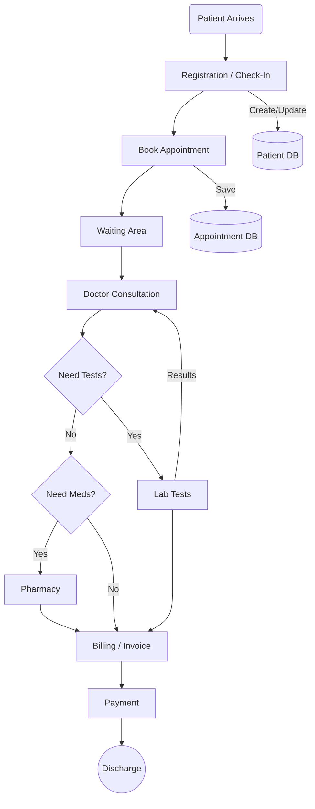

# HMS Project Flows & User Journeys

This document outlines the operational flows of the Hospital Management System (HMS), detailing how different roles interact and the journey of a patient through the facility.

## 1. Patient Journey (End-to-End Flow)

The core lifecycle of the system revolves around the Patient.

### **Phase 1: Entry & Registration**
- **Actor:** Front Desk (Receptionist)
- **Action:**
  1.  Patient arrives at the hospital.
  2.  Front Desk checks if the patient is new or returning.
  3.  **New:** Front Desk uses **`Register Patient`** module to create a Patient Record (Name, Age, Contact).
  4.  **Existing:** Front Desk searches for the Patient ID.

### **Phase 2: Appointment & Triage**
- **Actor:** Front Desk / Nurse
- **Action:**
  1.  Front Desk books an appointment via **`Appointment Management`**.
  2.  Selects Department (e.g., Cardiology) and Doctor.
  3.  Allocates a time slot.
  4.  (Optional) Nurse records initial Vitals (BP, Weight, Temperature).

### **Phase 3: Consultation**
- **Actor:** Doctor
- **Action:**
  1.  Doctor views **`My Appointments`**.
  2.  Selects the patient.
  3.  Reviews history and vitals.
  4.  **Diagnosis:** Doctor adds notes/diagnosis.
  5.  **Prescription:** Doctor prescribes medicine (Pharmacy) or Tests (Lab).

### **Phase 4: Diagnostics (If Prescribed)**
- **Actor:** Lab Technician
- **Action:**
  1.  Lab Tech sees **`Pending Test Requests`**.
  2.  Collects sample/performs test.
  3.  Enters results into the system.
  4.  Status updates to "Completed".
  5.  Doctor gets notified (or checks records).

### **Phase 5: Billing & Discharge**
- **Actor:** Front Desk (Billing Section)
- **Action:**
  1.  System aggregates charges (Consultation Fee + Lab Tests + Medicines).
  2.  Front Desk generates an **Invoice** via **`Billing`** module.
  3.  Patient pays (Cash/Insurance).
  4.  Receipt printed.
  5.  Patient is discharged.

---

## 2. Role-Based Workflows

### **Admin Flow**
*The Architect & Overseer*
1.  **System Setup:** Create Departments, Rooms/Wards.
2.  **User Management:** Register Doctors, Nurses, Receptionists, and Lab Techs.
3.  **Monitoring:** View Dashboard for:
    *   Total Patients Today.
    *   Active Doctors.
    *   Revenue Stats.

### **Front Desk Flow**
*The Director of Operations*
1.  **Dashboard:** Check "Today's Appointments" and "New Registrations".
2.  **Patient Handling:** Register -> Book Appointment -> Check-in.
3.  **Billing:** Generate bills for completed services.

### **Doctor Flow** (Planned)
*The Care Provider*
1.  **Schedule:** View daily schedule.
2.  **Consultation:** Digital prescription pad and history viewer.
3.  **Referrals:** Send patient to Lab or another Specialist.

### **Lab Technician Flow** (Planned)
*The Diagnostics*
1.  **Queue:** View list of patients waiting for tests.
2.  **Result Entry:** Input numeric/text findings.

---

## 3. Visual Flow Diagram

## 4. Current Implementation Status vs. Flow

| Feature | Status | Notes |
| :--- | :--- | :--- |
| **Admin Controls** | ✅ Active | Users & Doctors management active. |
| **Registration** | ✅ Active | Front Desk can register patients. |
| **Appointments** | ✅ Active | Booking UI implemented. |
| **Billing** | ✅ Active | Integrated into Front Desk. |
| **Doctor Module** | 🚧 Planned | Module exists, features pending. |
| **Lab Module** | 🚧 Planned | Module exists, features pending. |
| **Nurse Module** | 🚧 Planned | Module exists, features pending. |
