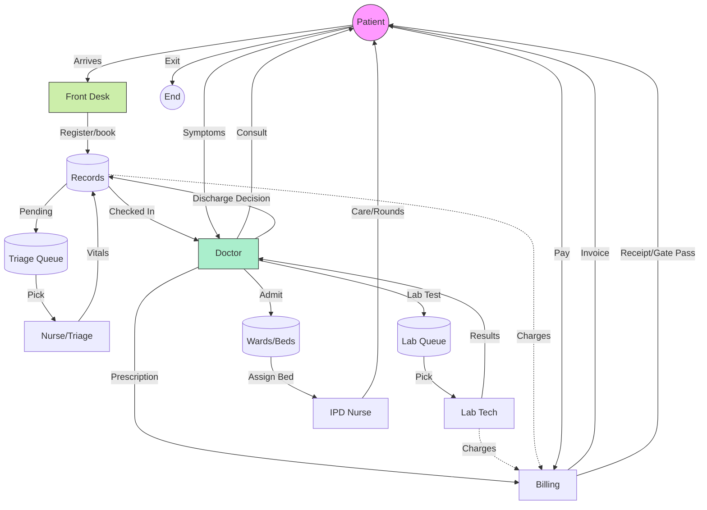

# HMS Project Flows & User Journeys

This document outlines the operational flows of the Hospital Management System (HMS), detailing how different roles interact and the journey of a patient through the facility.

## 1. Patient Journey (End-to-End Flow)

The core lifecycle of the system revolves around the Patient.

### **Phase 1: Entry & Registration**

- **Actor:** Front Desk (Receptionist)
- **Action:**
  1.  Patient arrives at the hospital.
  2.  Front Desk checks if the patient is new or returning.
  3.  **New:** Front Desk uses **`Register Patient`** module to create a Patient Record (Name, Age, Contact).
  4.  **Existing:** Front Desk searches for the Patient ID.

### **Phase 2: Appointment & Triage**

- **Actor:** Front Desk / Nurse
- **Action:**
  1.  Front Desk books an appointment via **`Appointment Management`**.
  2.  **Triage:** Patient goes to Nurse Station.
  3.  Nurse checks **`Triage Queue`** (`/triage`).
  4.  Nurse records Vitals (BP, Temp, Weight) via **`Vitals Form`**.
  5.  Appointment Status updates to **`Checked In`**.

### **Phase 3: Consultation (OPD)**

- **Actor:** Doctor
- **Action:**
  1.  Doctor views **`My Appointments`**.
  2.  Selects the patient (Status: Checked In).
  3.  Views history and Vitals recorded by Nurse.
  4.  **Decision:**
      - **Prescribe Meds:** Sends to Pharmacy.
      - **Order Tests:** Creates **`Lab Request`**.
      - **Admit Patient:** Initiates **`IPD Admission`**.

### **Phase 4: Consumption of Services**

#### **A. Diagnostics (Lab)**
- **Actor:** Lab Technician
- **Action:**
  1.  Tech views **`Lab Queue`** (`/lab`).
  2.  Patient status is "Requested".
  3.  Tech collects sample -> enters results (`/lab/results`).
  4.  Status updates to **`Completed`**.

#### **B. Inpatient Care (IPD)**
- **Actor:** Nurse / Admin
- **Action:**
  1.  **Admission:** Assign Ward and Bed (`/ipd/admit`).
  2.  **Bed Management:** Bed is marked "Occupied".
  3.  **Care:** Daily rounds, status monitoring.

### **Phase 5: Discharge & Billing**

- **Actor:** Admin / Billing Desk
- **Action:**
  1.  **Discharge:** Doctor/Admin clicks **`Discharge`** in Admission List.
  2.  Fills **Discharge Summary** (Diagnosis, Advice).
  3.  **Billing Trigger:** System auto-generates Invoice.
  4.  **Payment:** Front Desk views **`Billing Summary`**, collects payment, marks as **`Paid`**.
  5.  Patient leaves; Bed marked "Available".

---

## 2. Role-Based Workflows

### **Admin Flow**

_The Architect & Overseer_

1.  **System Setup:** Create Departments, Rooms/Wards.
2.  **User Management:** Register Doctors, Nurses, Receptionists, and Lab Techs.
3.  **Monitoring:** View Dashboard for:
    - Total Patients Today.
    - Active Doctors.
    - Revenue Stats.

### **Front Desk Flow**

_The Director of Operations_

1.  **Dashboard:** Check "Today's Appointments" and "New Registrations".
2.  **Patient Handling:** Register -> Book Appointment -> Check-in.
3.  **Billing:** Generate bills for completed services.

### **Doctor Flow**

_The Care Provider_

1.  **Schedule:** View daily schedule.
2.  **Consultation:** View Patient History -> Diagnosis -> Prescribe/Admit/Refer.
3.  **IPD:** Round visits -> Discharge decision.

### **Nurse Flow**

_The Caregiver_

1.  **OPD:** Monitor `Triage Queue` -> Record Vitals.
2.  **IPD:** Bed Management -> Patient Vitals -> Med Administration.

### **Lab Technician Flow**

_The Diagnostics_

1.  **Queue:** View real-time `Lab Queue` of pending requests.
2.  **Processing:** Select request -> Enter numeric/text results -> Save.
3.  **Completion:** Request moves to history; Result available to Doctor.

---

## 3. Visual Flow Diagram

## 4. Current Implementation Status vs. Flow

| Feature            | Status     | Notes                              |
| :----------------- | :--------- | :--------------------------------- |
| **Admin Controls** | ✅ Active  | Users & Doctors management active. |
| **Registration**   | ✅ Active  | Front Desk can register patients.  |
| **Appointments**   | ✅ Active  | Booking UI implemented.            |
| **Billing**        | ✅ Active  | Integrated into Front Desk.        |
| **Doctor Module**  | ✅ Active  | Consultation, History, Prescriptions. |
| **Lab Module**     | ✅ Active  | Requests, Results, Queue.          |
| **Nurse Module**   | ✅ Active  | Triage, Vitals, IPD Bed Management.|
