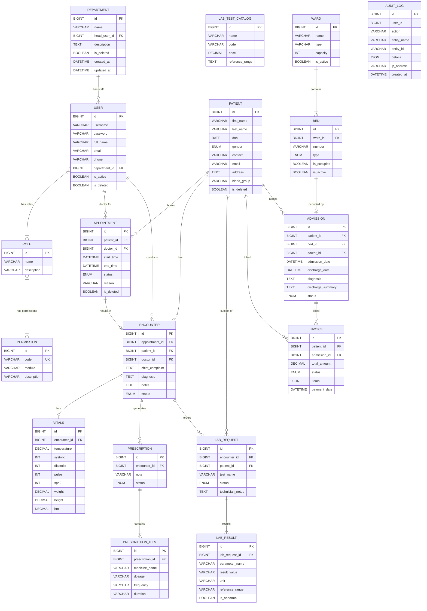

# Database Entity Relationship Diagram

This diagram represents the schema defined in `database_implementation_plan.md`.

```mermaid
erDiagram
    %% Core Entity Tables
    DEPARTMENT {
        BIGINT id PK
        VARCHAR name
        BIGINT head_user_id FK
        TEXT description
        BOOLEAN is_deleted
        DATETIME created_at
        DATETIME updated_at
    }

    USER {
        BIGINT id PK
        VARCHAR username
        VARCHAR password
        VARCHAR full_name
        VARCHAR email
        VARCHAR phone
        BIGINT department_id FK
        BOOLEAN is_active
        BOOLEAN is_deleted
    }

    ROLE {
        BIGINT id PK
        VARCHAR name
        VARCHAR description
    }

    PERMISSION {
        BIGINT id PK
        VARCHAR code UK
        VARCHAR module
        VARCHAR description
    }

    PATIENT {
        BIGINT id PK
        VARCHAR first_name
        VARCHAR last_name
        DATE dob
        ENUM gender
        VARCHAR contact
        VARCHAR email
        TEXT address
        VARCHAR blood_group
        BOOLEAN is_deleted
    }

    %% Transactional Tables
    APPOINTMENT {
        BIGINT id PK
        BIGINT patient_id FK
        BIGINT doctor_id FK
        DATETIME start_time
        DATETIME end_time
        ENUM status
        VARCHAR reason
        BOOLEAN is_deleted
    }

    ENCOUNTER {
        BIGINT id PK
        BIGINT appointment_id FK
        BIGINT patient_id FK
        BIGINT doctor_id FK
        TEXT chief_complaint
        TEXT diagnosis
        TEXT notes
        ENUM status
    }

    VITALS {
        BIGINT id PK
        BIGINT encounter_id FK
        DECIMAL temperature
        INT systolic
        INT diastolic
        INT pulse
        INT spo2
        DECIMAL weight
        DECIMAL height
        DECIMAL bmi
    }

    PRESCRIPTION {
        BIGINT id PK
        BIGINT encounter_id FK
        VARCHAR note
        ENUM status
    }

    PRESCRIPTION_ITEM {
        BIGINT id PK
        BIGINT prescription_id FK
        VARCHAR medicine_name
        VARCHAR dosage
        VARCHAR frequency
        VARCHAR duration
    }

    LAB_TEST_CATALOG {
        BIGINT id PK
        VARCHAR name
        VARCHAR code
        DECIMAL price
        TEXT reference_range
    }

    LAB_REQUEST {
        BIGINT id PK
        BIGINT encounter_id FK
        BIGINT patient_id FK
        VARCHAR test_name
        ENUM status
        TEXT technician_notes
    }

    LAB_RESULT {
        BIGINT id PK
        BIGINT lab_request_id FK
        VARCHAR parameter_name
        VARCHAR result_value
        VARCHAR unit
        VARCHAR reference_range
        BOOLEAN is_abnormal
    }

    WARD {
        BIGINT id PK
        VARCHAR name
        VARCHAR type
        INT capacity
        BOOLEAN is_active
    }

    BED {
        BIGINT id PK
        BIGINT ward_id FK
        VARCHAR number
        ENUM type
        BOOLEAN is_occupied
        BOOLEAN is_active
    }

    ADMISSION {
        BIGINT id PK
        BIGINT patient_id FK
        BIGINT bed_id FK
        BIGINT doctor_id FK
        DATETIME admission_date
        DATETIME discharge_date
        TEXT diagnosis
        TEXT discharge_summary
        ENUM status
    }

    INVOICE {
        BIGINT id PK
        BIGINT patient_id FK
        BIGINT admission_id FK
        DECIMAL total_amount
        ENUM status
        JSON items
        DATETIME payment_date
    }

    AUDIT_LOG {
        BIGINT id PK
        BIGINT user_id
        VARCHAR action
        VARCHAR entity_name
        VARCHAR entity_id
        JSON details
        VARCHAR ip_address
        DATETIME created_at
    }

    %% Relationships
    DEPARTMENT ||--o{ USER : "has staff"
    
    USER }|--|{ ROLE : "has roles"
    ROLE }|--|{ PERMISSION : "has permissions"
    
    USER ||--o{ APPOINTMENT : "doctor for"
    USER ||--o{ ENCOUNTER : "conducts"
    
    PATIENT ||--o{ APPOINTMENT : "books"
    PATIENT ||--o{ ENCOUNTER : "has"
    PATIENT ||--o{ LAB_REQUEST : "subject of"
    PATIENT ||--o{ INVOICE : "billed"

    APPOINTMENT ||--o| ENCOUNTER : "results in"
    
    ENCOUNTER ||--o| VITALS : "has"
    ENCOUNTER ||--o{ PRESCRIPTION : "generates"
    ENCOUNTER ||--o{ LAB_REQUEST : "orders"
    
    PRESCRIPTION ||--|{ PRESCRIPTION_ITEM : "contains"
    

    
    LAB_REQUEST ||--|{ LAB_RESULT : "results"

    WARD ||--|{ BED : "contains"
    BED ||--o| ADMISSION : "occupied by"
    PATIENT ||--o{ ADMISSION : "admits"
    ADMISSION ||--o{ INVOICE : "billed"
```
