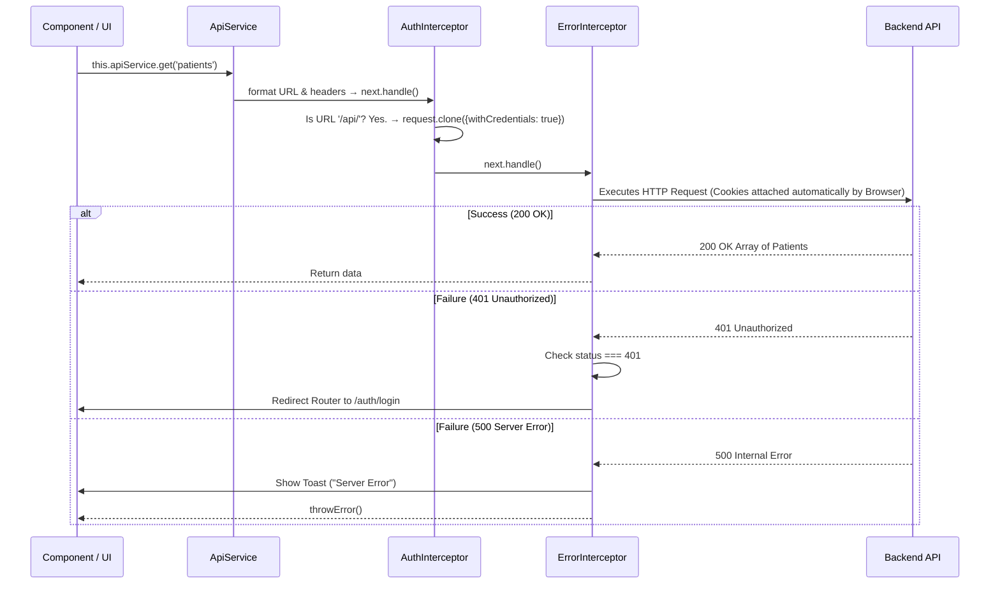

# Frontend Project Architecture

This document provides a comprehensive technical overview of the Angular frontend project. It details the high-level architecture, how various modules interact, the problem this structure solves, and focuses heavily on the request lifecycle, authentication mechanisms, error handling, and security.

---

## 1. High-Level Architecture

The frontend is an Angular Single Page Application (SPA) structured following the **Core, Shared, and Feature module pattern**. This ensures scalability, maintainability, and clear separation of concerns.

* **Core Module (`src/app/core`)**: Contains singleton services (`ApiService`, `AuthService`, `ErrorStateService`), global interceptors (`AuthInterceptor`, `ErrorInterceptor`), guards, and application-wide configurations. It is imported *only once* in the `AppModule`.
* **Shared Module (`src/app/shared`)**: Contains reusable dumb components, structural directives, and common modules (like PrimeNG UI modules). Imported by any feature module that needs them.
* **Feature Modules (`src/app/features`)**: Contains domain-specific areas (e.g., `Admin`, `Patients`, `Appointments`, `Billing`, `Lab`, `Triage`). These are **lazy-loaded** via `app-routing.module.ts` to optimize bundle size and initial load time.

---

## 2. Problem Statement

A modern healthcare or enterprise application faces several critical challenges:
1. **Security & Session Management**: Storing JWTs or sensitive tokens in `localStorage` makes the application vulnerable to Cross-Site Scripting (XSS).
2. **Predictable API Interactions**: Every outgoing HTTP request needs consistent headers, correct base URLs, and credential inclusions.
3. **Global Error Handling**: Uncaught HTTP errors disrupt the user experience. 401 (Unauthorized) errors need seamless redirects, and 500 (Server Errors) need standardized, non-intrusive notifications.
4. **Scalability**: As the application grows to include more modules (IPD, Consultation, Dashboard), the frontend needs a way to separate code bundles and restrict access based on user roles and permissions.

---

## 3. Solution Approach

To solve these problems, the project utilizes the following mechanics:
* **Lazy Loading & Guards**: Routes are strictly protected by `AuthGuard` (checks if a user is logged in) and `PermissionGuard` (checks specific `MOD_*` permissions). Feature modules are only loaded when accessed.
* **HttpOnly Cookies for Auth**: Rather than relying on `localStorage`, the frontend relies on the backend to set `HttpOnly` cookies. The frontend simply includes these cookies in API requests via `withCredentials: true`.
* **Centralized API Service**: The `ApiService` acts as the single gateway for all `GET`, `POST`, `PUT`, `PATCH`, and `DELETE` requests, injecting correct base URLs and default headers.
* **Http Interceptors**: 
  * `AuthInterceptor`: Clones outgoing API requests to append credentials.
  * `ErrorInterceptor`: Catches all HTTP errors globally, translates them into user-friendly UI toasts (via PrimeNG `MessageService`), and handles automatic logouts/redirects for 401/403 errors.

---

## 4. Code Breakdown

### A. Routing & Module Loading (`app-routing.module.ts`)
The application defines primary routes to its feature modules using `loadChildren`:
```typescript
{
  path: 'patients',
  loadChildren: () => import('./features/patients/patients.module').then(m => m.PatientsModule),
  canActivate: [AuthGuard, PermissionGuard],
  data: { permission: 'MOD_PATIENTS' },
}
```
* **Why this exists**: It defers the loading of the `PatientsModule` until the user navigates to `/patients`.
* **Guard Mechanics**: Before loading, Angular checks `AuthGuard`. If passed, it checks `PermissionGuard` using the `data` payload (`MOD_PATIENTS`).

### B. The API Gateway (`ApiService`)
```typescript
get<T>(path: string, params: HttpParams = new HttpParams()): Observable<T> {
  return this.http.get<T>(this.getUrl(path), {
    headers: this.getHeaders(),
    params,
  });
}
```
* **Why this exists**: It abstracts Angular's `HttpClient`. Every request automatically uses `application/json` headers and constructs the URL against `environment.apiUrl`.

### C. Authentication Flow (`AuthService`)
The app uses a `BehaviorSubject` to hold the current user state:
```typescript
// On app startup, check if we are logged in
loadCurrentUser(): void {
  this.apiService.get<User>('auth/me').pipe(
    catchError(() => of(null)) // If it fails, we are simply logged out
  ).subscribe(user => this.currentUserSubject.next(user));
}
```
* **Why this exists**: It silently attempts to fetch `/auth/me`. Since the `AuthInterceptor` attaches `withCredentials`, the backend reads the `HttpOnly` cookie. If valid, the user is logged in without prompting for a password.

### D. The Auth Interceptor (`AuthInterceptor`)
```typescript
if (request.url.includes('/api/')) {
  request = request.clone({
    withCredentials: true,
  });
}
```
* **Why this exists**: It forces Angular's `HttpClient` to include browser cookies for Cross-Origin (CORS) requests.
* **Why clone?**: Angular `HttpRequest` objects are immutable by design. To modify a request (adding headers or credentials), we must create a cloned copy.
* **Why restrict to `/api/`?**: If the app fetches external resources (e.g., public CDNs, OpenStreetMaps, generic SVGs), sending our domain's secure cookies is a severe **security risk** and triggers CORS errors on the third-party server.

### E. The Error Interceptor (`ErrorInterceptor`)
Catches all responses and filters them:
* **401**: Route to `/auth/login`. Unauthenticated.
* **403**: Route to `/error/unauthorized`. Authenticated, but lacking permissions.
* **404**: Route to `/error/not-found`.
* **500**: Triggers a global `MessageService` popup (e.g., "Internal Server Error") without killing the UI state.

---

## 5. Request Lifecycle

Below is the lifecycle of a standard API call (e.g., Fetching Patients).



---

## 6. Security Deep Dive

### HttpOnly Cookies vs LocalStorage
The project employs **HttpOnly cookies** for session management.
* **The Problem with LocalStorage**: Any JavaScript running on the page (including malicious scripts injected via XSS) can read `localStorage.getItem('token')` and steal the user's identity.
* **The Solution**: The backend sets a `Set-Cookie: session_id=...; HttpOnly; Secure; SameSite=Strict` header upon login.
* **The Result**: The browser stores the cookie, but `document.cookie` (JavaScript) **cannot read it**. When Angular makes an API call, the browser automatically attaches the cookie *if* `withCredentials: true` is set.

### CORS & Backend Configuration
For this architecture to work, the backend must be strictly configured:
1. `Access-Control-Allow-Origin`: **Cannot be `*`**. It must explicitly match the frontend URL (e.g., `http://localhost:4200` or `https://app.hospital.com`).
2. `Access-Control-Allow-Credentials`: Must be `true`.
3. If these are mismatched, the browser will instantly block the request with a **CORS error**, even if the backend processed it successfully.

---

## 7. CTO-Level Q&A Section

**Q: If we use HttpOnly cookies, how does the frontend know who the user is?**
**A:** The frontend doesn't need to read the token. On load, it calls `/api/auth/me`. The browser attaches the cookie. The backend validates it and returns the user's profile (name, roles, permissions). The frontend stores *this profile data* in memory (`AuthService`), not the token itself.

**Q: Why are we checking `request.url.includes('login')` in the Auth Interceptor's 401 handler?**
**A:** When a user types a wrong password, the backend returns 401. We do *not* want the interceptor to redirect the user to `/auth/login` because they are already there! We want the login component to catch the error and show "Invalid credentials" to the user.

**Q: What happens if a session expires while a user is filling out a massive form?**
**A:** When they hit submit, the backend returns `401 Unauthorized`. The `AuthInterceptor` catches it globally and redirects to `/auth/login`. (See *Possible Improvements* below on how to make this better).

**Q: Why do we have an `ApiService` wrapping `HttpClient`?**
**A:** Without it, developers would constantly write `this.http.get(environment.apiUrl + '/patients')`. The wrapper abstracts base URLs, enforces standard JSON headers everywhere, and creates a single place to modify how requests are structured (e.g., converting to/from specific formats later if needed).

---

## 8. Possible Improvements

1. **Silent Token Refresh (Rotations)**: Currently, a 401 instantly kicks the user out. If using short-lived JWTs, the frontend could attempt to hit a `/api/auth/refresh` endpoint silently during the interceptor catch block, and if successful, retry the original request without disrupting the user.
2. **Offline Support / Caching**: The `ApiService` could be extended to use `IndexedDB` or Angular's `HttpCache` to cache `GET` requests, allowing the application to function temporarily if the network drops.
3. **Pending Changes Guard**: Adding a `CanDeactivate` guard to complex forms (like Billing or Consultation) so if the router attempts a redirect (due to a 401 or a misclick), it warns the user: "You have unsaved changes."
4. **Error Correlation IDs**: The backend should emit a `X-Correlation-ID` header on 500 errors. The `ErrorInterceptor` can read this header and show it in the Toast: *"Internal Server Error (Ref: A838B2)"*. This massively speeds up debugging for backend teams viewing logs.
